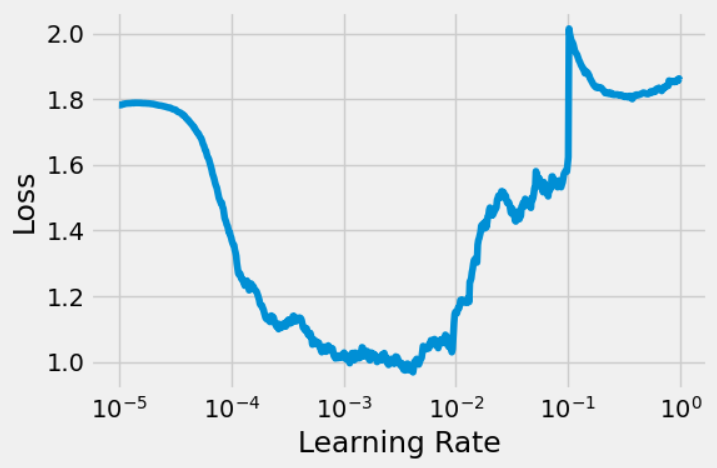

# 🧠 Classificação de Imagens com CNNs (Intel Image Dataset)

Este projeto tem como objetivo treinar e avaliar diferentes arquiteturas de Redes Neurais Convolucionais (CNNs) para a tarefa de classificação de imagens. Utilizamos o dataset "Intel Image Classification", que contém imagens de cenas naturais divididas em 6 categorias.

### Autores

- Ernane Ferreira Rocha Junior  
- Quelita Míriam Nunes Ferraz

## 📁 Estrutura do Projeto

```bash
part-1/
│
├── assets/                       # Gráficos principais 
├── download-dataset.py/          # Script para download automático do Intel Image Dataset 
├── part1_base_model.ipynb/       # Etapas do experimento, modelos e avaliações 
└── README.md/                    # Documentação do projeto
```

## 📊 Dataset: Intel Image Classification
Este projeto utiliza o conjunto de dados Intel Image Classification, originalmente disponibilizado por Puneet Bansal no [Kaggle](https://www.kaggle.com/datasets/puneet6060/intel-image-classification).

O dataset contém cerca de 25.000 imagens coloridas com resolução padrão de 150x150 pixels. As imagens representam seis categorias distintas de ambientes naturais, conforme listadas abaixo:

* buildings – imagens de prédios e construções urbanas
* forest – paisagens de floresta
* glacier – formações de gelo e geleiras
* mountain – imagens de montanhas
* sea – paisagens marítimas e costeiras
* street – cenas urbanas de ruas

### 📁 Estrutura dos Dados
O conjunto está organizado em três subconjuntos principais:

```bash
dataset/intel-image-classification/
│
├── seg_train/        # Dados de treino (~14.000 imagens)
│   ├── buildings/
│   ├── forest/
│   ├── glacier/
│   ├── mountain/
│   ├── sea/
│   └── street/
│
├── seg_test/         # Dados de teste (~3.000 imagens rotuladas)
│   ├── buildings/
│   ├── forest/
│   ├── glacier/
│   ├── mountain/
│   ├── sea/
│   └── street/
│
└── seg_pred/         # Dados de predição (~7.000 imagens sem rótulo)
```

-----

## ⚙️ Arquiteturas dos Modelos

Foram implementadas e testadas três arquiteturas de CNN principais, com algumas variações no número de filtros.

### 1. SimpleCNN

É um modelo base com uma arquitetura sequencial simples:

  * 3 blocos de `Conv2d` -> `ReLU` -> `MaxPool2d`
  * Uma camada `Flatten` seguida por duas camadas `Linear` (`Dense`) para a classificação final.
  * **Variações Testadas:**
      * **Menos filtros:** Canais `(8, 16, 32)`
      * **Base:** Canais `(16, 32, 64)`
      * **Mais filtros:** Canais `(32, 64, 128)`

### 2. SimpleCNNWithBlocks

Uma evolução do modelo base, adicionando técnicas de regularização para combater o overfitting:

  * Cada bloco convolucional agora contém: `Conv2d` -> `BatchNorm2d` -> `ReLU` -> `MaxPool2d` -> `Dropout(0.25)`
  * A camada de classificação também inclui uma camada `Dropout(0.5)`.
  * O **Batch Normalization** (`BatchNorm2d`) ajuda a estabilizar e acelerar o treinamento, enquanto o **Dropout** desativa neurônios aleatoriamente para evitar que o modelo memorize os dados de treino.

### 3. EfficientStrideCNN

Uma arquitetura alternativa que substitui as camadas de `MaxPool2d` por convoluções com `stride=2`. Esta é uma abordagem mais moderna para reduzir a dimensão espacial dos mapas de características.

  * Utiliza convoluções com `kernel_size=5` e `stride=2` nas camadas iniciais.
  * Finaliza a parte convolucional com uma camada `AdaptiveAvgPool2d`, que adapta a saída para um tamanho fixo ($1 times 1$), tornando o modelo mais flexível a diferentes tamanhos de entrada.

-----

## 🚀 Metodologia de Treinamento

  * Foi utilizada uma classe `Architecture` para encapsular a lógica de treinamento, validação, salvamento e plotagem, garantindo reprodutibilidade.
  * Otimizador: `Adam`.
  * `CrossEntropyLoss`, adequada para tarefas de classificação multiclasse.
  * Todos os modelos foram treinados por **10 épocas**.

### Definição da Taxa de Aprendizagem (Learning Rate Finder)

A **taxa de aprendizagem (learning rate)** é um dos hiperparâmetros mais críticos no treinamento de redes neurais. Ela controla o tamanho do passo que o otimizador dá na direção contrária ao gradiente da perda.

  * Uma **taxa muito alta** pode fazer com que o modelo "salte" sobre o ponto de mínimo, levando a um treinamento instável ou à divergência (a perda explode).
  * Uma **taxa muito baixa** torna o treinamento excessivamente lento e pode fazer com que o modelo fique preso em um mínimo local subótimo.

Para evitar a escolha arbitrária deste valor, utilizamos a técnica **Learning Rate Range Test**. O método consiste em treinar o modelo por um pequeno número de iterações, começando com uma taxa de aprendizagem muito baixa e aumentando-a exponencialmente a cada passo. Plotamos a perda (Loss) em função da taxa de aprendizagem (Learning Rate) para analisar o comportamento do modelo.



**Análise da Curva:**
O gráfico acima mostra o resultado do nosso teste. Podemos observar três fases distintas:

1.  **Região Inicial ($10^{-5}$ a ~$10^{-4}$):** A perda permanece quase constante. A taxa de aprendizagem é tão baixa que o modelo mal consegue aprender.
2.  **Região de Queda Acentuada (~$10^{-4}$ a ~$10^{-2}$):** A perda começa a cair rapidamente. Esta é a **zona ideal** para escolher nossa taxa de aprendizagem, pois o modelo está aprendendo de forma eficiente e estável.
3.  **Região de Explosão (após ~$10^{-2}$):** A perda atinge um valor mínimo e depois "explode", subindo drasticamente. Aqui, a taxa de aprendizagem tornou-se alta demais, desestabilizando o treinamento.

**Resultados Obtidos e Escolha:**
O nosso script identificou dois pontos de interesse:

  * `Melhor LR (fundo do U): 0.004154`: O ponto onde a perda foi mínima. Usar este valor pode ser arriscado, pois está no limite da estabilidade.
  * `LR seguro antes do fundo: 0.000527`: Um ponto seguro na região de queda acentuada.

Com base nesta análise, a escolha de uma taxa de aprendizagem de **`1e-3` (ou `0.001`)** para os experimentos principais é totalmente justificada. Este valor está localizado bem no centro da região de queda acentuada, garantindo um treinamento rápido e estável.

-----

## 📊 Resultados e Análise

Os resultados após 10 épocas de treinamento foram consolidados na tabela abaixo:

| Modelo | Canais | Val Loss | Parâmetros |
| :--- | :--- | :---: | ---: |
| **Menos filtros 8-16-32** | (8, 16, 32) | **0,5781** | 1.334.038 |
| **Base 16-32-64** | (16, 32, 64) | 0,5855 | 2.678.694 |
| **Mais filtros 32-64-128** | (32, 64, 128) | 0,6428 | 5.402.566 |
| **EfficientStrideCNN** | (16, 32, 64) | 0,6531 | **50.726** |
| **Base + Blocos (BN/Dropout)** | (16, 32, 64) | 0,7726 | 2.678.918 |

### Análise dos Resultados:

-  **Melhor Desempenho:** Surpreendentemente, o modelo **`SimpleCNN` com menos filtros** (`8-16-32`) obteve o menor *Validation Loss* (`0,5781`). Isso sugere que, para este dataset e com 10 épocas de treino, uma arquitetura mais simples é mais eficaz e menos propensa a overfitting.

-  **Overfitting é Visível:** Os gráficos dos modelos `SimpleCNN` (Base e Mais Filtros) mostram um claro sinal de **overfitting**. A perda de treino (linha azul) continua a diminuir drasticamente, enquanto a perda de validação (linha laranja) se estabiliza ou começa a aumentar por volta da 5ª época. Isso significa que o modelo está memorizando os dados de treino em vez de aprender a generalizar.

-  **Eficácia da Regularização:** O modelo `Base + Blocos (BN/Dropout)` apresentou uma perda de validação maior. No entanto, seu gráfico mostra que as curvas de treino e validação estão muito mais próximas. Isso indica que o **`BatchNorm` e o `Dropout` foram eficazes em reduzir o overfitting**. Provavelmente, este modelo precisaria de mais épocas para convergir para um resultado melhor, já que a regularização torna o aprendizado mais lento e robusto.

-  **Complexidade vs. Performance:** O modelo com **`Mais filtros`** teve um desempenho pior e um número de parâmetros muito maior. Isso reforça a ideia de que "maior nem sempre é melhor". O aumento da complexidade acelerou o overfitting sem trazer ganhos de performance.

-  **Arquitetura Eficiente:** O modelo **`EfficientStrideCNN`** é notável por ter um número de parâmetros **extremamente baixo** (apenas 50 mil). Embora sua perda de validação não tenha sido a melhor, as curvas de treino e validação mostram uma tendência de queda constante, sugerindo que ele poderia se beneficiar muito de um treinamento mais longo. É uma arquitetura promissora para cenários com restrições de recursos.

### Conclusão Final

Dentro de um treinamento curto (10 épocas), **arquiteturas mais simples se saíram melhor**, mas mostraram sinais claros de overfitting. Técnicas de regularização como `BatchNorm` e `Dropout` provaram ser eficazes para combater esse problema, embora possam exigir mais tempo de treinamento para atingir seu potencial máximo. A arquitetura `EfficientStrideCNN` destaca-se pela sua eficiência em número de parâmetros, sendo uma excelente opção para implantação em dispositivos com hardware limitado.
